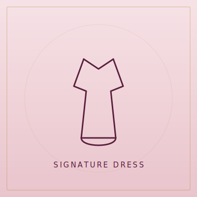

# Kim's Pretty Lady Fashion & Accessories — Website

A complete, responsive, premium multi-page website for **Kim's Pretty Lady Fashion & Accessories**, a women's clothing & accessories boutique in Louisville, MS.

Built with plain **HTML, CSS, and JavaScript** — no build tools, no frameworks, no dependencies to install. Just open the files in any browser or upload them to any web host.

---

## 1. What's included

```
kims-pretty-lady/
├── index.html          ← Home
├── collections.html    ← Product categories
├── shop.html           ← Featured items + styling packages + FAQ
├── about.html          ← Brand story, mission, values
├── contact.html        ← Contact form + map + details
├── css/
│   └── style.css       ← All styling (one file)
├── js/
│   └── script.js       ← All interactions (one file)
├── images/             ← Logo, favicon, hero, and all product/category art (SVG)
└── README.md           ← This file
```

To preview locally, just double-click `index.html`. To publish, upload the **entire folder** to your host (Netlify, Hostinger, GoDaddy, Vercel, cPanel, etc.).

---

## 2. ⚠️ IMPORTANT — About the images (please read)

Your client only provided a **Facebook page link**, not actual photo files. Facebook requires a login and blocks automated downloading, so I was **not able to pull the real product photos** off the page.

So that the site looks polished and complete right now, I created **custom, on-brand placeholder graphics** (elegant gold-on-plum illustrations) for every product and category. The site is fully designed to have these swapped out for the client's real photos whenever you're ready.

### How to replace a placeholder with a real photo

1. Save the real photos from Facebook (or get them directly from the client).
2. Drop them into the `images/` folder.
3. Open the page where the image appears and find the matching `` tag, e.g.:
   ```html
   
   ```
4. Change the `src` to your new file, e.g.:
   ```html
   
   ```

You can use `.jpg`, `.png`, or `.webp` — no code changes needed beyond the filename. Keep the `alt` text descriptive (good for SEO and accessibility).

**Which file is which:**
- `images/cat-*.svg` → the category tiles on **collections.html**
- `images/prod-1.svg … prod-6.svg` → the featured items on **shop.html** and **index.html**
- `images/hero-figure.svg` → the large illustration on the Home hero
- `images/logo.svg` (for dark backgrounds), `images/logo-dark.svg` (for light backgrounds), `images/favicon.svg` → branding. If the client has a real logo, replace these.

> Tip: For best results, crop product photos to a **square (1:1)** for category/product tiles so they fit the layout cleanly.

---

## 3. Editing business info (text, prices, links)

All content is plain text inside the HTML files — open them in any editor and edit directly.

**Already filled in across every page:**
- Business name: Kim's Pretty Lady Fashion & Accessories
- Location: Mt. Calvary Church Road, Louisville, MS
- Email: carterk343@gmail.com
- Facebook: https://www.facebook.com/Kimsclothingandaccessories

**Placeholders you'll want to update:**
- **Phone number** — currently `1-555-555-5555` (a placeholder). It appears as a clickable `tel:+15555555555` link and as a WhatsApp `wa.me/15555555555` link. Search-and-replace `5555555555` across all files once you have the real number.
- **Prices** — the sample prices on `shop.html` (featured items and the three styling packages) are examples. Edit them to match the client's real pricing.
- **Testimonials** — the reviews on the Home page are sample copy; swap in real client quotes when available.

---

## 4. How the contact form works

The contact form (on `contact.html`) and the quote form have **no server/backend**. When a visitor submits, it opens their email app with a pre-filled message addressed to **carterk343@gmail.com** (a standard `mailto:` handoff). This works anywhere with zero setup.

If the client later wants submissions to arrive automatically without the visitor's email app opening, you can wire the form to a free service like **Formspree**, **Netlify Forms**, or **Web3Forms** — only a couple of lines change in the form tag.

---

## 5. Fonts & internet note

The site uses Google Fonts (**Playfair Display** + **Jost**) loaded via CDN, so the device needs an internet connection to show the exact typefaces. If offline, the browser falls back to clean system fonts and the layout stays intact. (To make fonts fully offline, download them and host locally — optional.)

The Google Map on the Contact page is an embedded iframe and also needs internet.

---

## 6. Features built in

- Fully responsive (desktop / tablet / mobile) with a mobile menu
- Sticky glassmorphism navigation + smooth scrolling
- Scroll-reveal animations, animated stat counters, subtle parallax
- Loading animation on page open
- FAQ accordion (shop.html)
- Back-to-top button + WhatsApp quick-contact button
- SEO-ready: unique meta titles/descriptions, heading structure, image alt text, and ClothingStore structured data (JSON-LD) on the Home page

---

## 7. Quick customization cheatsheet

| Want to change… | Where |
|---|---|
| Colors / theme | top of `css/style.css` (the `:root` variables) |
| Phone number | search `5555555555` in all files |
| Prices | `shop.html` |
| Product/category images | `images/` folder + the `` tags |
| Testimonials | `index.html` |
| Map location | the `<iframe>` near the bottom of `contact.html` |

---

Built with care. Everything is plain, readable, well-structured code — easy to hand off, host, and maintain.

---

## 8. Enhancement pass — what was added

A round of polish focused on performance, accessibility, and SEO (no design disruption):

**Performance**
- All below-the-fold images now use `loading="lazy"` + `decoding="async"` so pages paint faster.
- `js/script.js` is now loaded with `defer` so it never blocks rendering.

**Accessibility**
- A "Skip to content" link (visible on keyboard focus) at the top of every page.
- Every page's content is wrapped in a proper `<main>` landmark.
- Clear gold focus outlines (`:focus-visible`) for keyboard navigation.

**SEO & PWA**
- `sitemap.xml` and `robots.txt` for search engines.
- `site.webmanifest` + `theme-color` so the site can be saved to a phone home screen with correct branding.
- A branded `404.html` error page (matches the site) — point your host's "not found" handler to it.

> ⚠️ **One edit needed before launch:** open `sitemap.xml` and `robots.txt` and replace `https://www.YOURDOMAIN.com` with the real domain once the site is hosted.

**Image lightbox** — clicking any product or collection image opens it in an elegant full-screen viewer (keyboard: Esc to close, arrow keys to browse). Works on the current artwork and on any real photos added later.

**New arrivals (real product photos)** — the Shop page now opens with a "New arrivals" section featuring real, unbranded inventory: the cream denim-pocket cardigan, the denim slouch boots, and a styled look. Add more real pieces by copying a square photo into `images/` and duplicating one of those `<article class="card">` blocks in `shop.html`.

---

## 9. Real products added + a note on photos

**Real inventory now live:** the home page has an "In Store Now" showcase and the Shop page leads with these real pieces (priced at $35):
- Coral Ribbed Dress, Green Sporty Dress, Red Sporty Dress, Pink Canvas Tote — plus the Denim-Pocket Cardigan and Denim Slouch Boots.

The earlier placeholder demo products (the `prod-1.svg … prod-6.svg` tiles) have been swapped out for these real photos. To add more pieces, copy a square photo into `images/` and duplicate one of the `<article class="card">` blocks in `shop.html` or `index.html`.

**About decorating with web images:** images pulled from Google/search results are almost always copyrighted, and putting them on a store can trigger the same kind of takedown/account problems as selling counterfeit goods. So the site's visual "pop" comes from custom-designed graphics and your own product photos — all safe to use commercially. If you ever want extra lifestyle photography, use a properly-licensed source (e.g. Unsplash or Pexels free licenses, or paid stock) rather than search-engine images.

---

## 10. Latest revisions

- **Removed** the "Complete-look styling packages" section from the Shop page (and cleaned up related page text/SEO).
- **Replaced the line-art icon graphics with real photos** on the home page: the hero now shows a real model photo, the "Featured collections" tiles use real product shots (Dresses, Tops & Knits, Shoes & Boots, Handbags), and the "Our Story" image is a real photo too.
- The old icon SVGs (`cat-*.svg`, `hero-figure.svg`) are no longer used on the home page; they're left in `images/` only as fallbacks and can be deleted.

**Note on the Collections page:** it still uses the line-art category icons for categories we don't have photos for yet (jewelry, hats, occasion wear, etc.). Send real photos for those categories and they'll be swapped to match the home page.
